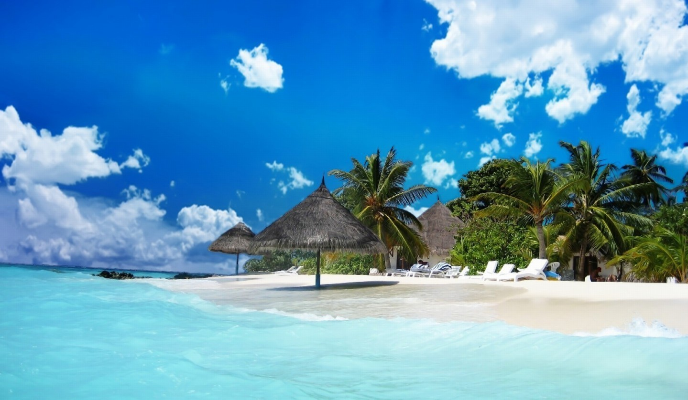

# Historical Sites

### Cebu Metropolitan Cathedral

Situated just a stone’s throw away from the famed Colon Street, the Cebu Metropolitan Cathedral, or the Metropolitan Cathedral of St. Vitales, is a Roman Catholic Church which holds the ecclesiastical seat of the Metropolitan Archdiocese of Cebu, considered by many to be the Fount of Christianity in the Far East.

The Second World War greatly damaged the cathedral, leaving mostly just the walls standing. the Church’s rich history is very much apparent from the its Spanish roots with Baroque-Rococo influences.

The brilliant interior design of the cathedral also serves as an incredible backdrop for wedding photos, making it highly desirable for weddings to be officiated in. Be sure to pay the Metropolitan Cathedral a visit; you might just witness a holy union!

Photo by: Greg muller Gallardo
Article by: Everything Cebu

### Cebu Taoist Temple

Open to believers and non-believers alike, the Cebu Taoist Temple sits 300 meters above sea level, towering over downtown Cebu. Accessible on foot through three separate, winding routes, this richly coloured temple is an absolute treat for the senses. Visitors will first be greeted by a small replica of the Great Wall of China located at the entrance of the temple. One can also find a chapel, library, and a wishing well amongst other things.

Visitors are also welcome to take part in a wish granting ritual, where visitors have to wash their hands before entering the chapel and tossing two blocks of wood onto the floor. Depending on how the blocks of woods land, the visitor could then have a chance to be granted a wish from the divine, or will have to make another visit to the temple for another chance for the wish to be granted.

Photo by: http://discoverphilippines.org/
Article by: Everything Cebu

# Beaches

### Malapascua

Distance from Cebu City: 2 hours and 30 minutes travel (72.2 miles)

Getting There: Take a bus bound for Maya in the North Bus Terminal. Then, ride a boat in Maya Port to reach the Malapascua island.

White-sand seashore and crystal clear waters will welcome you here in Malapascua, an island that's located in the northernmost tip of Cebu. Some of the exciting activities you can do in this famous tourist destination are swimming, scuba diving, snorkeling, skim boarding, and thresher shark watching.

Photo by: Everything Cebu
Article by: Everything Cebu

### Bantayan

Distance from Cebu City: 1 hour and 44 minutes (97 km)

Getting There: Take a bus bound for Badian in the South Bus Terminal. You will then be dropped off to Lambug, Badian or the Badian Golf Course junction where you need to ride a tricycle to be able to reach Lambug beach.

Lambug Beach is one of the must-go destinations in Badian, southwestern Cebu. It is a public beach, so you need not pay for any entrance fee to experience its enticing waters. You need to pay 50 pesos (as of 2012) though if you want to camp out by the seashore.

Photo by: Everything Cebu
Article by: Everything Cebu

### Oslob

Distance from Cebu City: 1 hour and 30 minutes (112.4 km)

Getting There: Take a bus in South Bus Terminal and ask the driver or conductor to drop you off at Barangay Tan-awan where the whale shark watching experience takes place.

This southern Cebu municipality is famous both for its beautiful beaches and rich underwater creatures, especially the ever-famous whale shark or butanding! Thanks to these huge, harmless sea animals, tourism in Oslob has experienced a significant boost for the past years. Go ahead and check out the wonders of this well-known destination yourself.

Photo by: Tim Digger
Article by: Everything Cebu